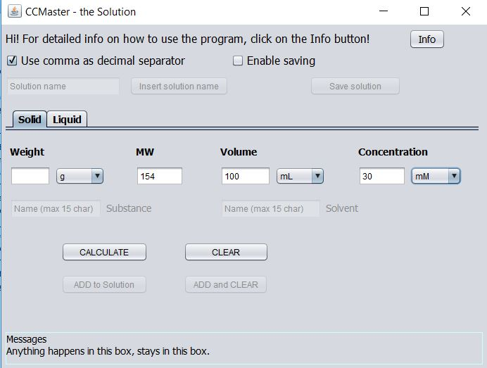
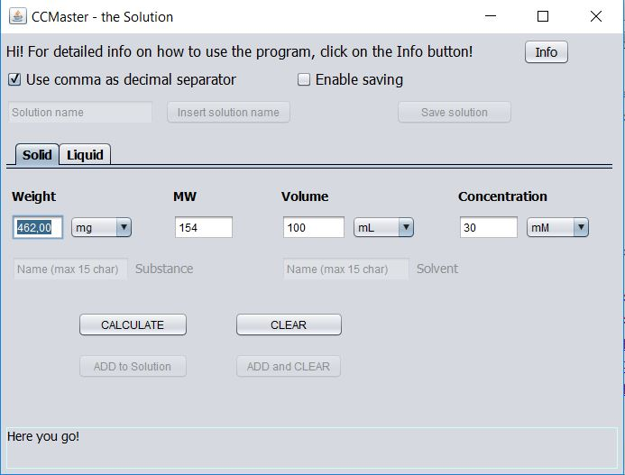
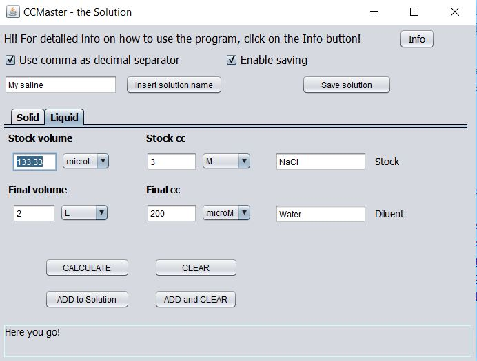
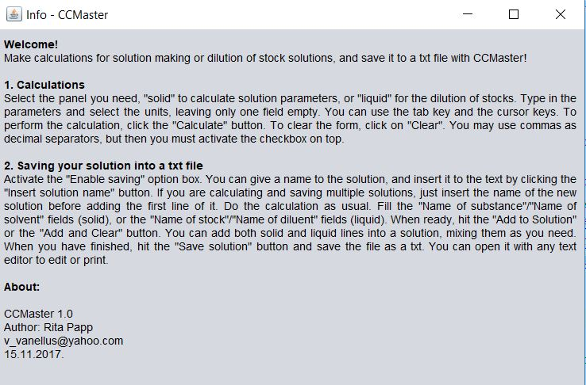

# CCMaster
A fully functional calculator to make/dilute solutions for biology/chemistry lab work.  

<h2> Do your lab calculations fast and convenient, and save the solution recipe! </h2>
 
Calculations for solution making, starting from solide substances or by diluting a more concentrated (so-called "stock") solution, are done everyday in biology and chemistry labs. Calculations are done manually or using some calculator website. 
This Java program has a user friendly GUI, can be used offline, and offers building complex solution recipes with multiple ingredients, which can be saved as a text file for further editing or print. 
The ranges of unit prefixes are chosen to accomodate to ranges occurring in real-life practice. In case an event is carried out successfully or an error occurs, the user is informed by a message box implemented in the GUI. 
 
 
The user interface before and after a calculation:

 
Calculation of liquid dilution, with saving options activated.

 
An info window is available to help users. 

 

The code is fully open source and the executable file is free to download. If you are interested, just send me a message for the download link. 

